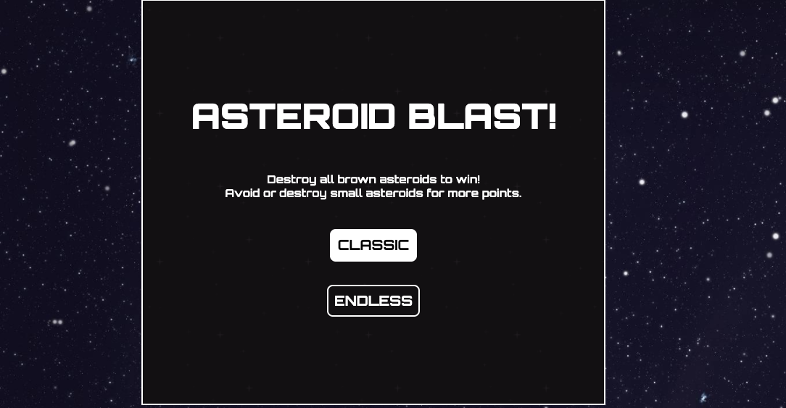
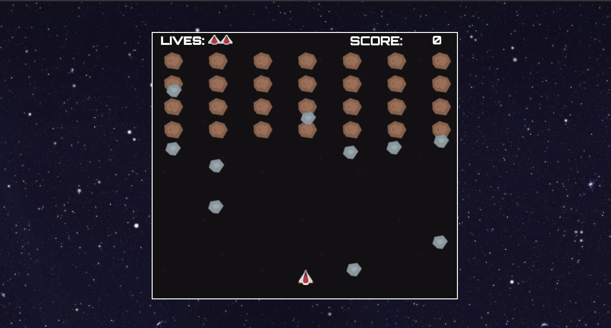
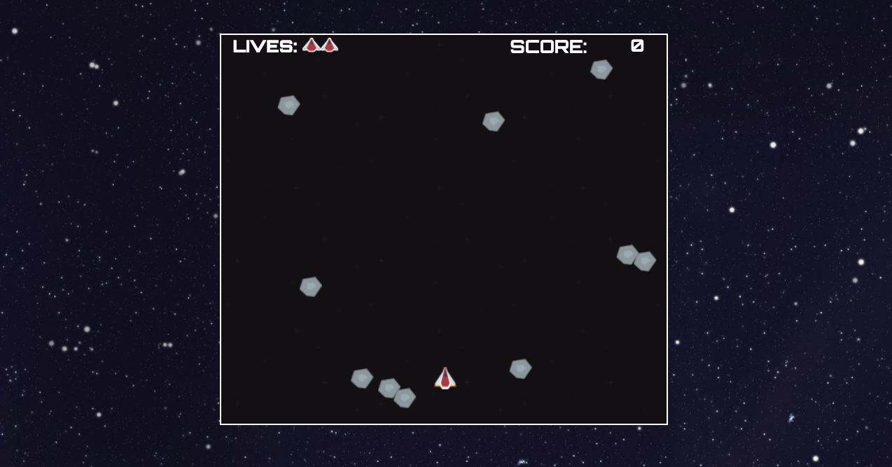

## Introduction
SEI 25 - Project 1
Game is hosted here: https://pages.git.generalassemb.ly/khairulsyazwan/Asteroid_Blast/

Start Screen

Classic Mode

Endless Mode

#### Game Sequence & Objectives
- The game is a spin-off of the ever so popular Space Invaders game.
- Player controls the spaceship on screen using the keyboard.
	- Up key for moving up
	- Down key for moving down
	- Right key for moving right
	- Left key for moving left
	- Spacebar to shoot lasers
- The player is free to move within the game area.
- In Classic Mode, game ends when all brown asteroids are destroyed.
- Player gets points added for every asteroid destroyed
	- 10 points for brown asteroids
	- 20 points for grey asteroids
- Player has 5 lives before game ends.
	- 1 life removed whenever a grey asteroid hits the payer
- In Endless Mode, player is free to destroy grey asteroids to get a high score.
	- Game ends when the players lives are depleted.

#### Project Objectives
**Technical Requirements**
- Display a game in the browser
- Be interactive
- Include separate HTML / CSS / JavaScript files
- Use Javascript for DOM manipulation that is triggered by a browser event

**Required Deliverables**
- A non-broken game, built by you, hosted somewhere on the internet
- A link to your hosted working game in the URL section of your Github repo
- A git repository hosted on Github, with a link to your hosted game, and frequent commits dating back to the very beginning of the project
- A readme.md file with explanations of the technologies used, the approach taken, installation instructions, unsolved problems, etc.

## Breakdown
#### Minimum Viable Product Features
- Player movement
	1. Movement on X and Y axis
	2. Ability to shoot lasers
- Hit detection for lasers and asteroids
	1. Asteroids and lasers should be removed when they intersect
- A basic UI
	1. Image for asteroids and spaceship

#### Additional Game Features
- Addition of Endless Mode
- Interactive buttons, sound on click, animations
- Sounds for lasers and asteroids when destroyed

#### Game Design & Pseudo Code Planning
- Generation of asteroids on screen by calculating space available and space required. Then using DOM manipulation to create them on screen when the game is initialised.
- Movement of game elements by using window.requestAnimationFrame() as a game loop.
	- Getting a value from time-stamps between the previous frame and the current frame
	- Then multiplying that value to a hardcoded speed value to move the elements Y and X position.
- Hit detection by calling getBoundingClientRect()
	- Comparing element top, bottom, right & left positions 
	- If it intersects, code will run to remove element from screen
- Limiting game element movement within the game screen
	- Asteroids are removed if they wander off screen
	- Player movement is limited to the game width and height
- Cooldown time feature to space out firing rate
	- Also implemented on the generation of small asteroids
- Randomising cooldown time for small asteroid generation
	- Small asteroids are generated by the bigger asteroids
	- Every big asteroid has been given a random cooldown time upon creation during game initialisation.

#### Technologies used:
1. Javascript
2. CSS
3. HTML

#### Bugs & Issues Faced
- Game crashes when laser hits 2 asteroids that are overlapping in Classic Mode.
	- Bug fixed by limiting when the laser can destroy the small asteroids. 
	- Small asteroid can only be hit when the Y position surpasses the Y position of the last asteroid row.
	- Change only applied to Classic Mode, so as to not affect the gameplay of Endless mode.

#### Further Possible Improvements
- Responsive page scaling for smaller screen devices
- Addition of difficulty levels
- Ability to choose laser and spaceship colour
- Saving high scores
